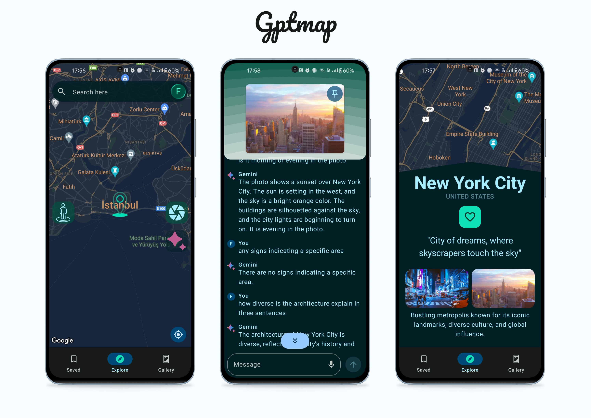
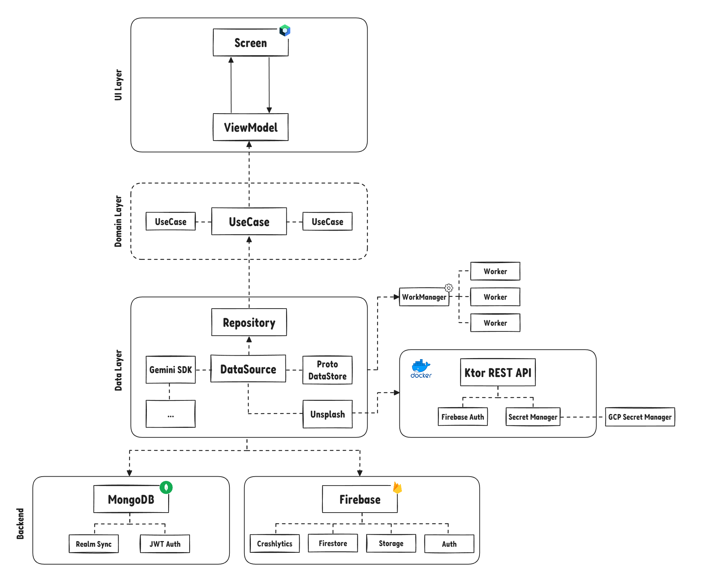

<h1 align="center">Gptmap🗺️🤖</h1>
<p align="center">Welcome to Gptmap, a startup project crafted using Kotlin and Jetpack Compose.</p>
 <p align="center" text-align="center">This project will guide you through creating a comprehensive Android application using a modern toolkit, highlighting the integration of AI technologies and illustrating the real-world applications of these advanced technologies, providing valuable insights and best practices.</p>



## Download

Go to the [Releases](https://github.com/f-arslan/GptMap/releases) to download the latest APK.

## Table of Contents

- [Architecture Overview](#architecture-overview)
- [Tech Stack & Open-source Libraries](#tech-stack--open-source-libraries)
- [App Demo](#app-demo)
- [Setup and Configuration Guide](#setup-and-configuration-guide)

## Architecture Overview



<p>This project is designed following the principles of Clean Architecture, utilizing a multi-modular approach. It includes several layers, including the UI Layer, Domain Layer, Data Layer, and the backend, to ensure a solid separation of concerns and enhance maintainability.

For the backend, Ktor for server-side logic, MongoDB for database management (Realm Sync and Auth for synchronization and authentication), Firebase for authentication, storage, and real-time database capabilities (Auth, Storage, Firestore), and GCP's Secret Manager for secure management of secrets and API keys.

## Tech Stack & Open-source Libraries


- **[Kotlin](https://kotlinlang.org/)**
- **[Jetpack Compose](https://developer.android.com/jetpack/compose)**
- **Jetpack Libraries**:
   - **ViewModel**
   - **SavedStateHandle**
   - **[Proto DataStore](https://developer.android.com/topic/libraries/architecture/datastore#proto-datastore)**
- **[Ktor](https://ktor.io/)**
- **Database and Storage Solutions**:
   - **MongoDB Realm**
   - **Firebase Firestore and Storage**
- **Asynchronous Programming**:
   - **[Coroutines](https://github.com/Kotlin/kotlinx.coroutines)** and **[Flow](https://kotlin.github.io/kotlinx.coroutines/kotlinx-coroutines-core/kotlinx.coroutines.flow/)**
- **Authentication Systems**:
   - **Firebase Auth**
   - **[MongoDB Realm JWT Auth](https://www.mongodb.com/docs/atlas/app-services/authentication/custom-jwt/)**
- **Dependency Injection Frameworks**:
   - **[Dagger2](https://dagger.dev/)**, **[Hilt](https://dagger.dev/hilt/)**, and **[Koin](https://insert-koin.io/)**
- **APIs & Services Integration**:
   - **Google Maps API**
   - **Third-party APIs (Gemini, Unsplash)**
- **Image Loading and Animation Libraries**:
   - **Coil**
   - **Lottie**
 


- **Material Design 3**
- **[Kotlin Symbol Processing (KSP)](https://github.com/google/ksp)**
- **WorkManager**
- **Architectural Patterns**:
   - **MVVM and MVI**
- **Core Android Features**:
   - Services, Broadcast Receivers, and Intents
- **Project Organization**:
   - Multi-module structure with version catalogue
- **Networking**:
   - **[Retrofit](https://github.com/square/retrofit)**
- **Testing Suite**:
   - **JUnit 4 & 5**, **[Mockk](https://mockk.io/)**, and **[turbine](https://github.com/cashapp/turbine)**
- **Code Quality Tools**:
   - **[Detekt](https://github.com/detekt/detekt)**
   - **[Ktlint](https://ktlint.github.io/)**
- **Performance Optimization**:
  - **Baseline Profiles**
  - **Macrobenchmark**
- **Continuous Integration and Deployment** (CI/CD):
   - **GitHub Actions**
   - **[Docker](https://www.docker.com/)**
- **[GCP Secret Manager](https://cloud.google.com/security/products/secret-manager)**

## App Demo

Check out the [resources](public/) for the full list.

https://github.com/f-arslan/GptMap/assets/66749900/68769bcf-8dcc-4e9d-8bec-6d6f393dc7b6

### Setup and Configuration Guide

Getting started with this project involves several key steps to ensure everything is set up correctly. Follow this guide to configure your development environment and integrate all necessary services:

1. **Android Studio Iguana**: This project is optimized for Android Studio Iguana. While it might work on lower versions, Gradle plugin 8.2.2 is required for the best experience. If you're using an older version, consider updating to avoid compatibility issues.
2. **Setting up `local.properties`**: This file contains essential environment variables. You won't need an OpenAI key as it will be deprecated. Fill in the necessary API keys and URLs except for the OpenAI key:

```properties {"id":"01HQGK9942PRCD1VKM59AC6BYM"}
sdk.dir=<path_to_your_android_sdk>
MAPS_API_KEY=<your_google_maps_api_key>
OPENAI_API_KEY= (will be deprecated, no need to fill this)
PALM_API_KEY=<your_gemini_api_key>
UNSPLASH_BASE_URL=<unsplash_api_base_url>
```

Ensure you replace placeholder text with actual values relevant to your development environment.

3. **Remove Keystore Related Configurations**: For development purposes, remove or comment out any keystore configurations in your Gradle build files. This simplifies the build process for initial setup and testing.
4. **Setup Docker and GCP Secret Manager**: Docker is used for containerization, ensuring a consistent environment for development and deployment. GCP Secret Manager stores and manages access to your application's secrets. Skipping this step means you won't be able to use AI features on images, though you can still proceed with other functionalities. For Docker, install Docker and follow the setup instructions for your OS. For GCP Secret Manager, set up a GCP account, create a new project, and follow the instructions to store your secrets.
5. **Firebase Setup**: To integrate Firebase, create a new project in the Firebase console, register your app, and download the `google-services.json` file. Place this file in your app's `app` directory. This step is crucial for utilizing Firebase Auth, Firestore, and Storage.
6. **MongoDB Atlas Setup**: Sign up or log in to MongoDB Atlas, create a new cluster, and connect your application using the provided connection string. Ensure you've configured the network access and database user for your cluster.
7. **GCP Account Requirement**: A Google Cloud Platform (GCP) account is necessary for utilizing Google Maps API and GCP Secret Manager. If you don't already have an account, sign up at [GCP's website](https://cloud.google.com/) and set up billing to access these services.
